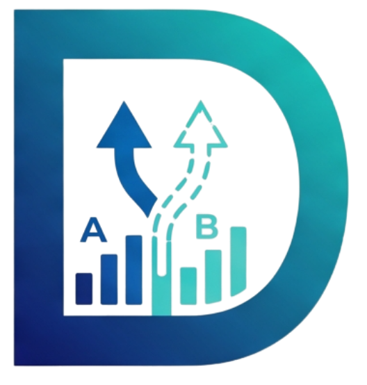
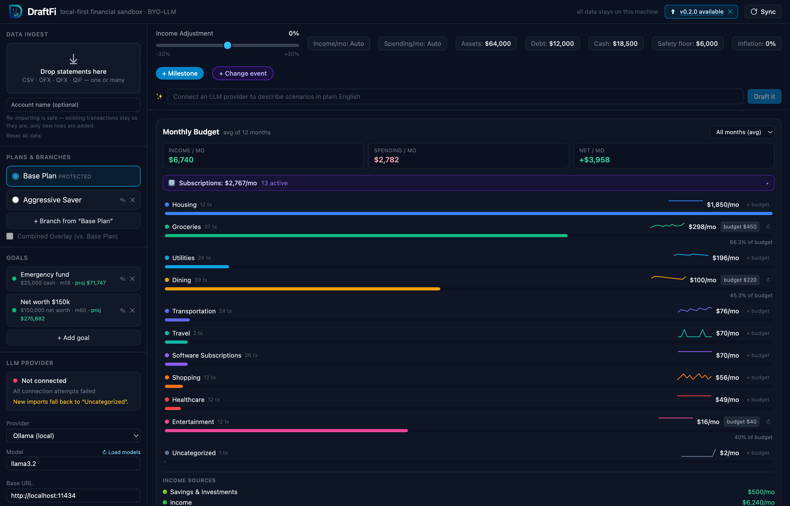
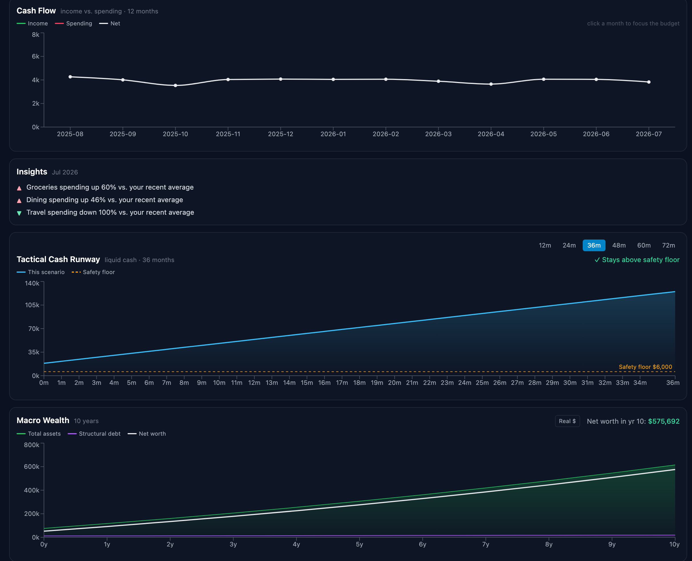
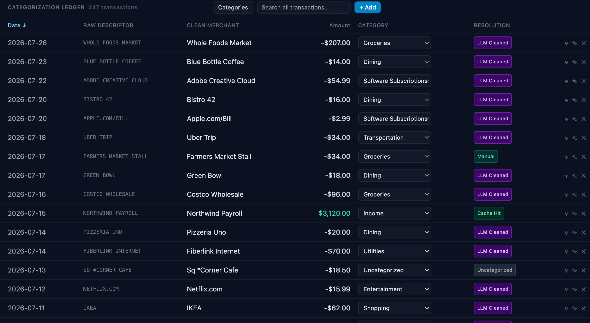

<p align="center">
  
</p>

<h1 align="center">DraftFi</h1>

<p align="center"><strong>Local-first, BYO-LLM financial "what-if" simulation engine.</strong></p>

<p align="center">
  <a href="https://github.com/arcwel/draftfi/releases/latest"></a>
  <a href="https://github.com/arcwel/draftfi/releases"></a>
  <a href="https://github.com/arcwel/draftfi/actions/workflows/ci.yml"></a>
  
</p>

DraftFi is an open-source personal financial forecasting app for forward-looking
scenario modeling. Unlike commercial tools that require fragile bank-syncing
APIs, DraftFi processes **all data locally on your machine** and uses a **Bring
Your Own LLM** paradigm for transaction cleaning and categorization — so nothing
ever leaves your computer.

- 🔒 **Private by design** — SQLite lives client-side; no cloud, no data leaks.
  API keys are stored in your **OS keychain** (Keychain / DPAPI), and an optional
  **app passcode** locks the whole app until you unlock it.
- 🧠 **BYO-LLM** — pick your provider in-app: local **Ollama** (default, fully
  offline) or bring your own **OpenAI / Anthropic / Gemini** key. A **Test
  connection** button and a live **model picker** validate your setup on the
  spot.
- 📊 **Budget from real data** — average monthly spend per category with inline
  sparklines, per-category targets (with over/under flags and rollover), a
  specific-month view, and a **cash-flow** chart across your history.
- 🔁 **Recurring-charge detection & insights** — DraftFi surfaces your recurring
  subscriptions and generates plain-English monthly insights ("Dining up 46% vs.
  your recent average"), optionally narrated by your LLM.
- 📈 **Real simulation engine** — a tactical cash-runway (12–72 mo) and macro
  wealth (5–30 yr) view with **loan amortization**, income/expense **change
  events**, an **inflation** toggle, and **goal tracking** (on/off-track).
- 🌿 **Sandbox branches & compare** — duplicate a plan, mutate it freely, and
  **overlay multiple scenarios** against a protected Base Plan with a delta table.
- ⚡ **Deterministic caching** — each raw descriptor is cleaned by the LLM once,
  then cached forever, so re-imports never re-query the model.
- 🖥️ **One-click desktop app** — download and double-click on **macOS, Windows,
  or Linux**; no Python, Node, terminal, or setup. Auto-detects new releases.
  See [DESKTOP.md](DESKTOP.md).
- 🌍 **Multi-currency** — one setting reformats every amount (USD, EUR, GBP, …).

---

## A quick tour

> The screenshots below use built-in **demo data**, not real accounts.

**One dense workspace.** Import a bank statement in the sidebar; DraftFi cleans
and categorizes every transaction, then shows your monthly budget with per-
category sparklines, detected subscriptions, savings goals, and sandbox
branches — all on one screen.



**Forecast, then understand.** A month-over-month cash-flow line, auto-generated
**insights**, a **tactical cash runway** (with an adjustable safety floor and
on/off-track goals), and a multi-decade **macro wealth** view — assets stacked
over structural debt, with an optional inflation-adjusted "real $" toggle.



**Fix a category in one click.** Every transaction shows how it was resolved
(`Cache Hit`, `LLM Cleaned`, `Manual`, `Override`); change a category inline and
the rule is remembered for all past and future imports. Search, sort, split, and
add manual transactions from the same ledger.



---

## Architecture

```
┌──────────────┐   HTTP/JSON    ┌───────────────┐   local HTTP   ┌────────────┐
│  React + Vite│ ─────────────► │  FastAPI       │ ─────────────► │ Local LLM  │
│  (frontend)  │ ◄───────────── │  (backend)     │ ◄───────────── │ (Ollama…)  │
└──────────────┘                └──────┬────────┘                └────────────┘
                                       │
                                 ┌─────▼──────┐
                                 │ sandbox.db │  (SQLite, client-side)
                                 └────────────┘
```

- **Frontend:** React 18, Tailwind CSS, Recharts, Zustand.
- **Backend:** Python 3.11+, FastAPI, SQLite (stdlib `sqlite3`), httpx.
- **AI layer:** any local OpenAI-compatible / Ollama-native inference server.

See [`DraftFi_PRD.md`](DraftFi_PRD.md) for the full product spec and
[`TASKS.md`](TASKS.md) for the build breakdown.

---

## Get DraftFi

- **Just want to use it?** Download the desktop app (macOS/Windows) and
  double-click — no setup. See **[DESKTOP.md](DESKTOP.md)**.
- **Want to develop or self-host?** Follow the quick starts below.

---

## Quick start (native)

### 1. Backend

```bash
cd backend
python3.11 -m venv .venv           # 3.11–3.13 recommended
source .venv/bin/activate
pip install -r requirements.txt
cp .env.example .env               # optional: edit LLM endpoint/model
uvicorn app.main:app --reload --port 8000
```

The API is now on `http://localhost:8000` (interactive docs at `/docs`). The
SQLite database `sandbox.db` is created and seeded automatically on first boot.

### 2. Frontend

```bash
cd frontend
npm install
npm run dev                        # http://localhost:5173
```

Vite proxies `/api/*` to the backend, so no CORS juggling is needed in dev.

### 3. Choose an LLM provider (in the app)

The **LLM Provider** panel in the sidebar configures categorization. Everything
is stored locally in `sandbox.db` — pick a provider, set the model, and (for
cloud providers) paste an API key:

| Provider | Key required | Data locality | Default model |
| --- | --- | --- | --- |
| **Ollama** (default) | no | fully local / air-gapped | `llama3.2` |
| **OpenAI (ChatGPT)** | yes | descriptor sent to OpenAI | `gpt-4o-mini` |
| **Anthropic (Claude)** | yes | descriptor sent to Anthropic | `claude-haiku-4-5` |
| **Gemini (Google)** | yes | descriptor sent to Google | `gemini-2.0-flash` |

Use **Test connection** to validate a pasted key/endpoint on the spot, and
**↻ Load models** to pull the provider's live model list into the picker. Once a
key is stored the field shows `•••• stored` with an **Update** button (and an ✕
to remove it). Keys are per-provider, so switching back and forth never loses
them. For full privacy, stay on Ollama — pull a model first:

```bash
ollama pull llama3.2
```

Without any reachable LLM, imports still work — rows are queued as
**Uncategorized** and you can categorize them by hand (which teaches the cache
for next time).

> **Note:** cloud providers send the raw descriptor string to their API. Only
> Ollama keeps categorization fully on your machine.

---

## Quick start (Docker)

```bash
docker compose up --build
```

This builds and runs the backend (`:8000`) and the frontend (`:5173`). To reach
a host-installed Ollama from inside the containers, the compose file maps
`host.docker.internal`.

---

## How categorization works

1. On import, each raw descriptor is looked up in `merchant_llm_cache`.
2. **Cache hit** → clean merchant + category applied instantly (`Cache Hit`).
3. **Cache miss** → one local LLM call returns strict JSON
   `{"clean_merchant": "...", "category": "..."}` (`LLM Cleaned`), and the mapping
   is written to the cache immediately.
4. **Manual override** in the ledger updates the cache rule and re-tags **all**
   past and future transactions sharing that raw string (`Override`).

## How the budget works

The **Monthly Budget** panel turns your transaction history into an at-a-glance
monthly picture:

- **Per-category spending** — each category's average monthly spend, normalized
  by the number of distinct months in your data (so one large statement doesn't
  distort the rate). Income categories are split out from expenses.
- **Budget targets** — click *+ budget* on any category to set a monthly limit;
  the bar turns red and shows *N% of budget · over* when you exceed it. Targets
  persist in `sandbox.db`.
- **Scenario impact** — the panel shows how the active scenario changes your
  monthly net: the income slider scales income, and each milestone's recurring
  payment adds a monthly commitment (with its active month window). You see
  `Net/mo: +$1,622 → +$1,912` update live as you tweak the sliders.

## How the simulation works

Discrete monthly recurrence (PRD §7):

```
Cash_Ending_t = Cash_Starting_t + Inflows_t − Outflows_t − Milestone_Costs_t
```

Baseline monthly inflow/outflow are derived from your imported history. On top of
that, the engine models:

- **Loan amortization** — a milestone's recurring payment splits into interest +
  principal (from its APR), so mortgage/auto-loan payoff and net worth are real.
- **Change events** — "raise to $X at month N" or "expenses drop $Y at month M"
  reshape monthly cash flow from that month on.
- **Inflation** — the macro view can show net worth in today's dollars.
- **Multi-scenario compare** — overlay Base + any branches with a delta table at
  12 / 36 / 72 months.
- **Goals** — target net worth or cash by a month; a live pill shows on/off-track.

The macro view compounds assets and structural debt monthly over a 5–30 year
horizon to expose the opportunity cost of large purchases.

## Security & privacy

- **API keys** are written to the OS keychain (macOS Keychain, Windows DPAPI) via
  `keyring`; only a marker lives in `sandbox.db`. Headless/dev installs fall back
  to a plaintext setting. Provider errors are scrubbed of any key before display.
- **App passcode** (optional) is stored as a salted PBKDF2 hash. When set, the
  backend starts locked and refuses data routes with `423` until you unlock —
  so it gates the data, not just the UI.

---

## Testing

```bash
cd backend && source .venv/bin/activate
pytest          # 128 tests: schema/migrations, CSV/OFX/QIF, LLM, budget,
                # simulation, subscriptions, insights, security, API
ruff check .    # lint
```

```bash
cd frontend
npm run lint    # eslint
npm test        # vitest (store, format, lock screen, error boundary)
npm run build   # production build check
```

CI runs all of the above on every push (`.github/workflows/ci.yml`).

---

## Project layout

```
backend/
  app/
    api/         # FastAPI routers (import, transactions, llm, simulation,
                 # budget, goals, insights, settings, data, export, scenario)
    db/          # schema, migrations, connection, repository
    models/      # Pydantic schemas
    services/    # llm (multi-provider), llm_config (keychain), csv_parser,
                 # statement_parsers, categorization, ingestion, sync,
                 # simulation, budget, subscriptions, insights, updates,
                 # security, preferences, scenario_parser
    main.py      # app factory + lifespan DB init + passcode gate
  desktop.py     # packaged-app launcher (single-instance, tray, webview)
  tests/         # pytest suite
  sample_data/   # example statements (CSV/OFX/QIF, multiple bank formats)
frontend/
  src/
    zones/       # Sidebar, SimulationStrip, Charts, Ledger (PRD's 4 zones)
    components/  # dropzone, branches, charts, modals, lock screen, settings,
                 # subscriptions/insights, error boundary, badges
    lib/         # api.js (backend client), format.js (currency/locale)
    store/       # Zustand store (state + debounced recompute)
    *.test.*     # Vitest unit tests
```

## License

[MIT](LICENSE). No premium tiers, no feature locks — every capability is free
and open (Success Criterion 3).
