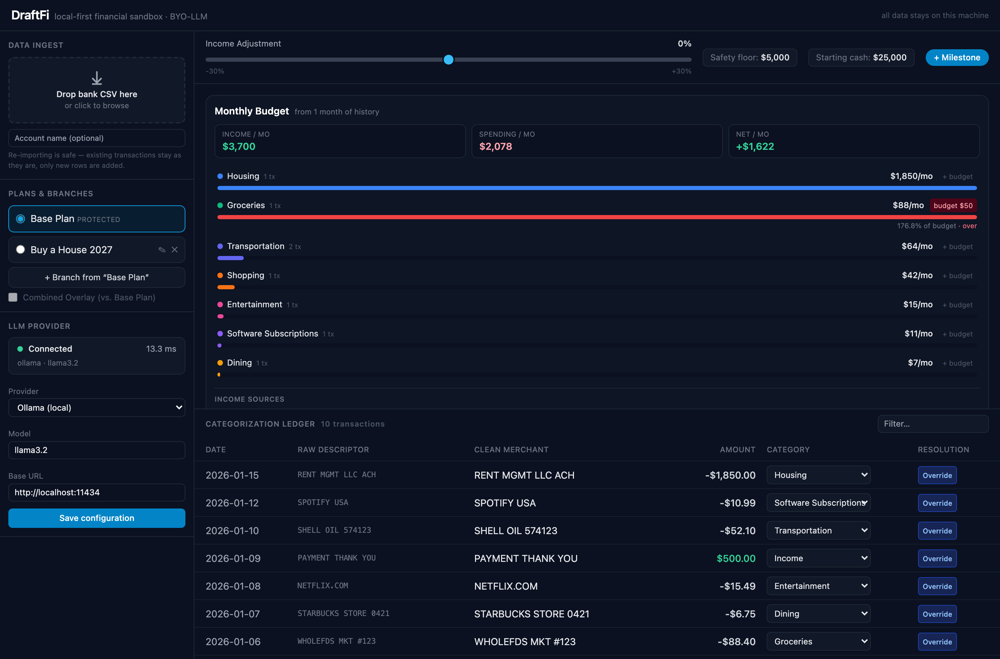
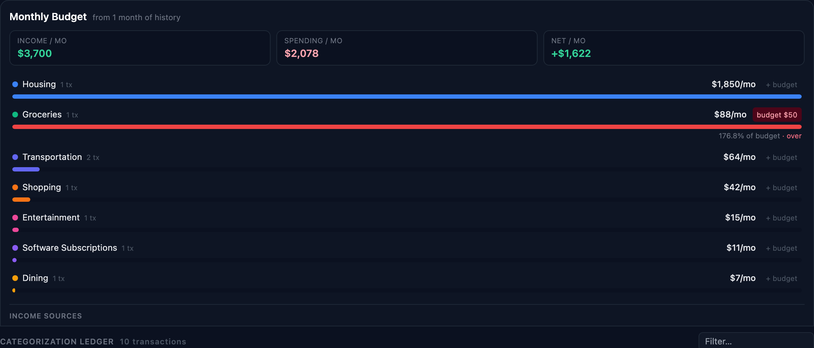
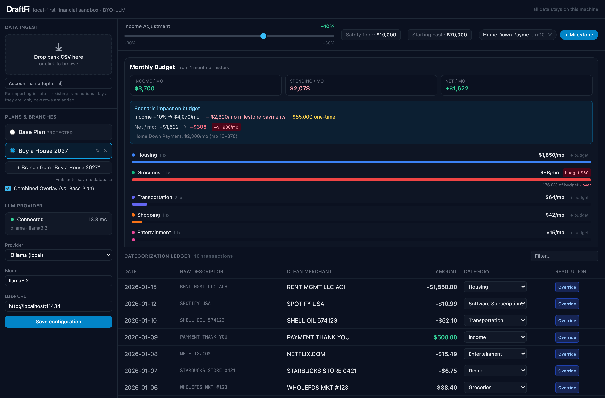
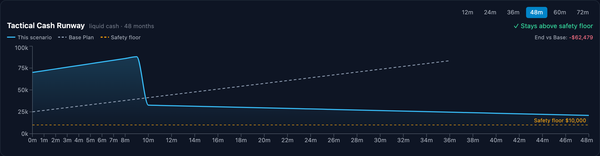
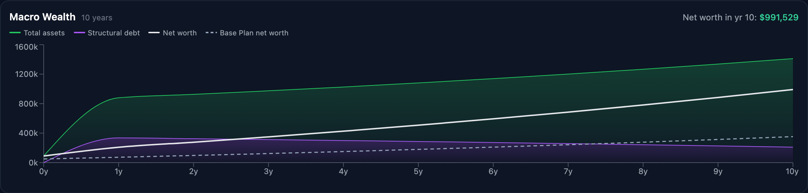
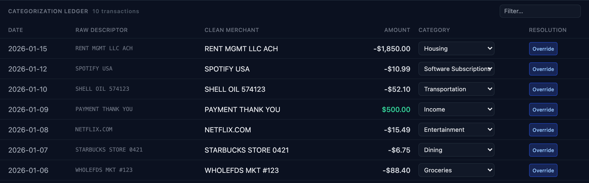

# DraftFi

**Local-first, BYO-LLM financial "what-if" simulation engine.**

DraftFi is an open-source personal financial forecasting app for forward-looking
scenario modeling. Unlike commercial tools that require fragile bank-syncing
APIs, DraftFi processes **all data locally on your machine** and uses a **Bring
Your Own LLM** paradigm for transaction cleaning and categorization — so nothing
ever leaves your computer.

- 🔒 **Private by design** — SQLite lives client-side; no cloud, no data leaks.
- 🧠 **BYO-LLM** — pick your provider in-app: local **Ollama** (default, fully
  offline) or bring your own **OpenAI / Anthropic / Gemini** API key. Keys are
  stored in the same local `sandbox.db` and never leave it except to call the
  provider you chose.
- ⚡ **Deterministic caching** — each raw descriptor is cleaned by the LLM once,
  then cached forever, so re-imports never re-query the model.
- 🖥️ **One-click desktop app** — download and double-click on macOS or Windows;
  no Python, Node, terminal, or setup. See [DESKTOP.md](DESKTOP.md).
- 💰 **Monthly budget** — see average monthly spending per category from your
  real history, set per-category budget targets (with over/under flags), and
  watch how income changes and milestones reshape your monthly net in real time.
- 📈 **Dual-view simulation** — a tactical cash-runway chart (12–72 months) and a
  macro wealth chart (5–30 years) update in real time as you drag sliders.
- 🌿 **Sandbox branches** — duplicate a plan, mutate it freely, and overlay it
  against a protected Base Plan to see the divergence.

---

## A quick tour

**One dense workspace.** Import a bank CSV in the sidebar; DraftFi cleans and
categorizes every transaction, then shows your monthly budget, a live cash-flow
forecast, and the full ledger — all on one screen.



**Your monthly budget, from real data.** Average monthly spend per category
(normalized across the months in your history), income vs. spending vs. net, and
optional per-category budget targets that flag when you go over.



**Model a big decision.** Branch off a protected Base Plan, drag the income
slider, and add milestones (e.g. a home down payment + mortgage). The budget
panel shows exactly how it hits your monthly net — here a house purchase turns a
**+$1,622/mo** surplus into a **−$308/mo** shortfall.



**See the divergence over time.** The Tactical Runway overlays your scenario
(solid) against the Base Plan (dashed) with an adjustable safety floor, so you
can see the exact month the money gets tight.



A second chart zooms out to the multi-decade view — total assets stacked over
structural debt, so you can weigh the opportunity cost of spending cash today.



**Fix a category in one click.** Every transaction shows how it was resolved
(`Cache Hit`, `LLM Cleaned`, `Override`); change a category inline and the rule
is remembered for all past and future imports.



---

## Architecture

```
┌──────────────┐   HTTP/JSON    ┌───────────────┐   local HTTP   ┌────────────┐
│  React + Vite│ ─────────────► │  FastAPI       │ ─────────────► │ Local LLM  │
│  (frontend)  │ ◄───────────── │  (backend)     │ ◄───────────── │ (Ollama…)  │
└──────────────┘                └──────┬────────┘                └────────────┘
                                       │
                                 ┌─────▼──────┐
                                 │ sandbox.db │  (SQLite, client-side)
                                 └────────────┘
```

- **Frontend:** React 18, Tailwind CSS, Recharts, Zustand.
- **Backend:** Python 3.11+, FastAPI, SQLite (stdlib `sqlite3`), httpx.
- **AI layer:** any local OpenAI-compatible / Ollama-native inference server.

See [`DraftFi_PRD.md`](DraftFi_PRD.md) for the full product spec and
[`TASKS.md`](TASKS.md) for the build breakdown.

---

## Get DraftFi

- **Just want to use it?** Download the desktop app (macOS/Windows) and
  double-click — no setup. See **[DESKTOP.md](DESKTOP.md)**.
- **Want to develop or self-host?** Follow the quick starts below.

---

## Quick start (native)

### 1. Backend

```bash
cd backend
python3.11 -m venv .venv           # 3.11–3.13 recommended
source .venv/bin/activate
pip install -r requirements.txt
cp .env.example .env               # optional: edit LLM endpoint/model
uvicorn app.main:app --reload --port 8000
```

The API is now on `http://localhost:8000` (interactive docs at `/docs`). The
SQLite database `sandbox.db` is created and seeded automatically on first boot.

### 2. Frontend

```bash
cd frontend
npm install
npm run dev                        # http://localhost:5173
```

Vite proxies `/api/*` to the backend, so no CORS juggling is needed in dev.

### 3. Choose an LLM provider (in the app)

The **LLM Provider** panel in the sidebar configures categorization. Everything
is stored locally in `sandbox.db` — pick a provider, set the model, and (for
cloud providers) paste an API key:

| Provider | Key required | Data locality | Default model |
| --- | --- | --- | --- |
| **Ollama** (default) | no | fully local / air-gapped | `llama3.2` |
| **OpenAI (ChatGPT)** | yes | descriptor sent to OpenAI | `gpt-4o-mini` |
| **Anthropic (Claude)** | yes | descriptor sent to Anthropic | `claude-haiku-4-5` |
| **Gemini (Google)** | yes | descriptor sent to Google | `gemini-2.0-flash` |

Once a key is stored the field shows `•••• stored` with an **Update** button
(and an ✕ to remove it). Keys are per-provider, so switching back and forth
never loses them. For full privacy, stay on Ollama — pull a model first:

```bash
ollama pull llama3.2
```

Without any reachable LLM, imports still work — rows are queued as
**Uncategorized** and you can categorize them by hand (which teaches the cache
for next time).

> **Note:** cloud providers send the raw descriptor string to their API. Only
> Ollama keeps categorization fully on your machine.

---

## Quick start (Docker)

```bash
docker compose up --build
```

This builds and runs the backend (`:8000`) and the frontend (`:5173`). To reach
a host-installed Ollama from inside the containers, the compose file maps
`host.docker.internal`.

---

## How categorization works

1. On import, each raw descriptor is looked up in `merchant_llm_cache`.
2. **Cache hit** → clean merchant + category applied instantly (`Cache Hit`).
3. **Cache miss** → one local LLM call returns strict JSON
   `{"clean_merchant": "...", "category": "..."}` (`LLM Cleaned`), and the mapping
   is written to the cache immediately.
4. **Manual override** in the ledger updates the cache rule and re-tags **all**
   past and future transactions sharing that raw string (`Override`).

## How the budget works

The **Monthly Budget** panel turns your transaction history into an at-a-glance
monthly picture:

- **Per-category spending** — each category's average monthly spend, normalized
  by the number of distinct months in your data (so one large statement doesn't
  distort the rate). Income categories are split out from expenses.
- **Budget targets** — click *+ budget* on any category to set a monthly limit;
  the bar turns red and shows *N% of budget · over* when you exceed it. Targets
  persist in `sandbox.db`.
- **Scenario impact** — the panel shows how the active scenario changes your
  monthly net: the income slider scales income, and each milestone's recurring
  payment adds a monthly commitment (with its active month window). You see
  `Net/mo: +$1,622 → +$1,912` update live as you tweak the sliders.

## How the simulation works

Discrete monthly recurrence (PRD §7):

```
Cash_Ending_t = Cash_Starting_t + Inflows_t − Outflows_t − Milestone_Costs_t
```

Baseline monthly inflow/outflow are derived from your imported history by
category. The macro view compounds assets and structural debt monthly over a
5–30 year horizon to expose the opportunity cost of large purchases.

---

## Testing

```bash
cd backend && source .venv/bin/activate
pytest          # 35 tests: schema, CSV, LLM parsing, cache, simulation, API
ruff check .    # lint
```

```bash
cd frontend
npm run build   # type-free build check
```

---

## Project layout

```
backend/
  app/
    api/         # FastAPI routers (import, transactions, llm, simulation)
    db/          # schema, migrations, connection, repository
    models/      # Pydantic schemas
    services/    # llm (multi-provider), llm_config, csv_parser,
                 # categorization, ingestion, simulation, budget
    main.py      # app factory + lifespan DB init
  tests/         # pytest suite
  sample_data/   # example bank CSVs (Chase, Amex, Euro formats)
frontend/
  src/
    zones/       # Sidebar, SimulationStrip, Charts, Ledger (PRD's 4 zones)
    components/  # Dropzone, BranchManager, charts, milestone modal, badges
    lib/api.js   # backend client
    store/       # Zustand store (state + debounced recompute)
```

## License

[MIT](LICENSE). No premium tiers, no feature locks — every capability is free
and open (Success Criterion 3).
