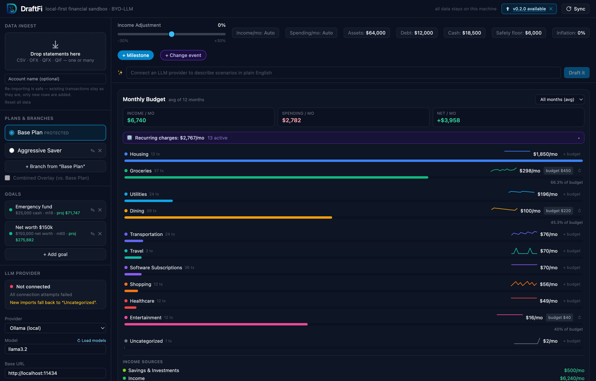
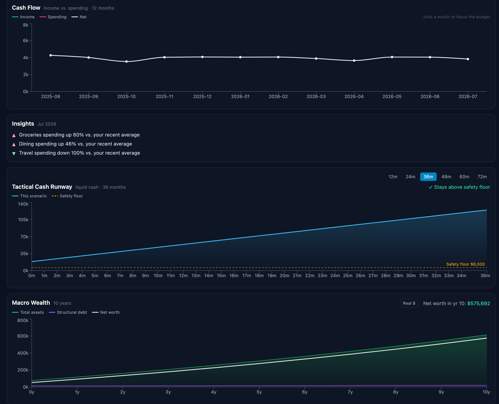
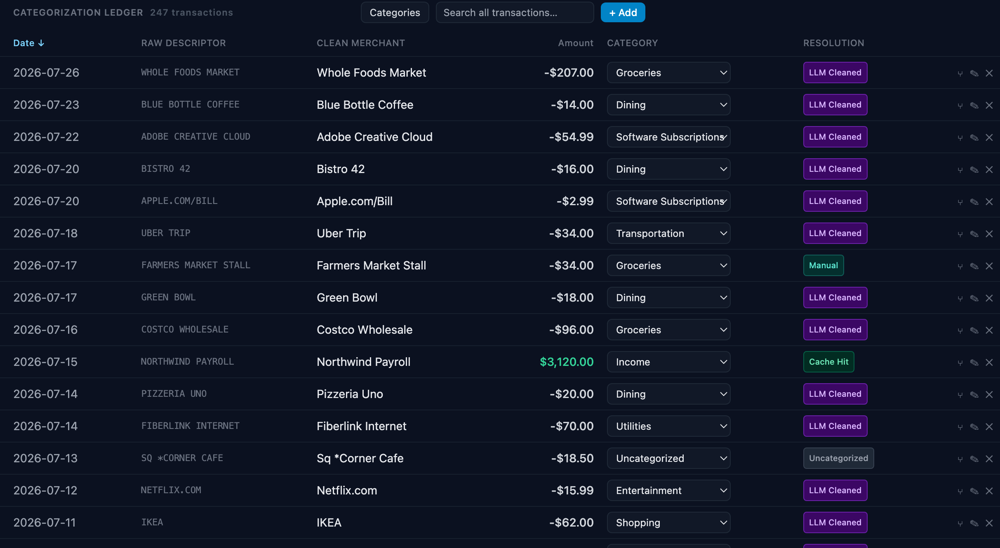

<p align="center">
  
</p>

<h1 align="center">DraftFi</h1>

<p align="center"><strong>Local-first, BYO-LLM financial "what-if" simulation engine.</strong></p>

<p align="center">
  <a href="https://github.com/arcwel/draftfi/releases/latest"></a>
  <a href="https://github.com/arcwel/draftfi/releases"></a>
  <a href="https://github.com/arcwel/draftfi/actions/workflows/ci.yml"></a>
  
</p>

DraftFi is an open-source personal financial forecasting app for forward-looking
scenario modeling. Unlike commercial tools that require fragile bank-syncing
APIs, DraftFi processes **all data locally on your machine** and uses a **Bring
Your Own LLM** paradigm for transaction cleaning and categorization — so nothing
ever leaves your computer.

- 🔒 **Private by design** — SQLite lives client-side; no cloud, no data leaks.
  API keys are stored in your **OS keychain** (Keychain / DPAPI), and an optional
  **app passcode** locks the whole app until you unlock it.
- 🧠 **BYO-LLM** — pick your provider in-app: local **Ollama** (default, fully
  offline) or bring your own **OpenAI / Anthropic / Gemini** key. A **Test
  connection** button and a live **model picker** validate your setup on the
  spot.
- 📊 **Budget from real data** — average monthly spend per category with inline
  sparklines, per-category targets (with over/under flags and rollover), a
  specific-month view, and a **cash-flow** chart across your history.
- 🔁 **Recurring-charge detection & insights** — DraftFi surfaces your recurring
  charges (subscriptions, rent, utilities) and generates plain-English monthly
  insights ("Dining up 46% vs. your recent average"), optionally narrated by
  your LLM.
- 📈 **Real simulation engine** — a tactical cash-runway (12–72 mo) and macro
  wealth (5–30 yr) view with **loan amortization**, income/expense **change
  events**, an **inflation** toggle, and **goal tracking** (on/off-track).
- 🌿 **Sandbox branches & compare** — duplicate a plan, mutate it freely, and
  **overlay multiple scenarios** against a protected Base Plan with a delta table.
- ⚡ **Categorize a merchant, not a transaction** — descriptors are reduced to a
  canonical merchant key (`AMAZON KIDS *B26ME6RT2` → `AMAZON KIDS`), so one
  decision settles every past and future row for that merchant. On a real
  10,371-row file this collapsed 4,787 raw strings to 1,537 merchants and
  resolved 62.5% with no model call at all.
- ✅ **Merchant Review queue** — whatever is left comes back as a keyboard-first
  queue ordered by how many transactions each decision settles, so the work is
  finite and front-loaded instead of a scroll through thousands of rows.
- 🧭 **Sign normalization** — card exports list a charge as *positive*. DraftFi
  detects that per account, per file, and flips it on import, so spending never
  reads as income. Detection needs overwhelming evidence and two non-conflicting
  signals; when it isn't sure it leaves your amounts exactly as they came in.
- 🖥️ **One-click desktop app** — download and double-click on **macOS, Windows,
  or Linux**; no Python, Node, terminal, or setup. Auto-detects new releases.
  See [DESKTOP.md](DESKTOP.md).
- 🌍 **Multi-currency** — one setting reformats every amount (USD, EUR, GBP, …).

---

## A quick tour

> The screenshots below use built-in **demo data**, not real accounts.

**One dense workspace.** Import a bank statement in the sidebar; DraftFi cleans
and categorizes every transaction, then shows your monthly budget with per-
category sparklines, detected recurring charges, savings goals, and sandbox
branches — all on one screen.



**Forecast, then understand.** A month-over-month cash-flow line, auto-generated
**insights**, a **tactical cash runway** (with an adjustable safety floor and
on/off-track goals), and a multi-decade **macro wealth** view — assets stacked
over structural debt, with an optional inflation-adjusted "real $" toggle.



**Fix a category in one click.** Every transaction shows how it was resolved
(`Rule`, `Transfer`, `Cache Hit`, `LLM Cleaned`, `Manual`, `Override`, `Split`);
change a category inline and the decision is remembered for that merchant across
all past and future imports. Search, sort, split, resize columns, and add manual
transactions from the same ledger.



---

## Architecture

```
┌──────────────┐   HTTP/JSON    ┌───────────────┐   local HTTP   ┌────────────┐
│  React + Vite│ ─────────────► │  FastAPI       │ ─────────────► │ Local LLM  │
│  (frontend)  │ ◄───────────── │  (backend)     │ ◄───────────── │ (Ollama…)  │
└──────────────┘                └──────┬────────┘                └────────────┘
                                       │
                                 ┌─────▼──────┐
                                 │ sandbox.db │  (SQLite, client-side)
                                 └────────────┘
```

- **Frontend:** React 18, Tailwind CSS, Recharts, Zustand.
- **Backend:** Python 3.11+, FastAPI, SQLite (stdlib `sqlite3`), httpx.
- **AI layer:** any local OpenAI-compatible / Ollama-native inference server.

See [`DraftFi_PRD.md`](DraftFi_PRD.md) for the full product spec and
[`TASKS.md`](TASKS.md) for the build breakdown.

---

## Get DraftFi

- **Just want to use it?** Download the desktop app (macOS/Windows) and
  double-click — no setup. See **[DESKTOP.md](DESKTOP.md)**.
- **Want to develop or self-host?** Follow the quick starts below.

---

## Quick start (native)

### 1. Backend

```bash
cd backend
python3.11 -m venv .venv           # 3.11–3.13 recommended
source .venv/bin/activate
pip install -r requirements.txt
cp .env.example .env               # optional: edit LLM endpoint/model
uvicorn app.main:app --reload --port 8000
```

The API is now on `http://localhost:8000` (interactive docs at `/docs`). The
SQLite database `sandbox.db` is created and seeded automatically on first boot.

### 2. Frontend

```bash
cd frontend
npm install
npm run dev                        # http://localhost:5173
```

Vite proxies `/api/*` to the backend, so no CORS juggling is needed in dev.

### 3. Choose an LLM provider (in the app)

The **LLM Provider** panel in the sidebar configures categorization. Everything
is stored locally in `sandbox.db` — pick a provider, set the model, and (for
cloud providers) paste an API key:

| Provider | Key required | Data locality | Default model |
| --- | --- | --- | --- |
| **Ollama** (default) | no | fully local / air-gapped | `llama3.2` |
| **OpenAI (ChatGPT)** | yes | merchant name sent to OpenAI | `gpt-4o-mini` |
| **Anthropic (Claude)** | yes | merchant name sent to Anthropic | `claude-haiku-4-5` |
| **Gemini (Google)** | yes | merchant name sent to Google | `gemini-flash-latest` |

Use **Test connection** to validate a pasted key/endpoint on the spot, and
**↻ Load models** to pull the provider's live model list into the picker. Once a
key is stored the field shows `•••• stored` with an **Update** button (and an ✕
to remove it). Keys are per-provider, so switching back and forth never loses
them. For full privacy, stay on Ollama — pull a model first:

```bash
ollama pull llama3.2
```

Without any reachable LLM, imports still work — rows are queued as
**Uncategorized** and you can categorize them by hand (which teaches the cache
for next time).

> **Note:** cloud providers receive the **normalized merchant key**, not the raw
> descriptor — card numbers, phone numbers, dates, amounts and auth codes are
> stripped before anything leaves your machine. Only Ollama keeps categorization
> fully local.

DraftFi also repairs its own LLM config: when a provider retires a model, the
app picks a live replacement, tells you what it swapped, and keeps working
rather than failing the import.

---

## Quick start (Docker)

```bash
docker compose up --build
```

This builds and runs the backend (`:8000`) and the frontend (`:5173`). To reach
a host-installed Ollama from inside the containers, the compose file maps
`host.docker.internal`.

---

## How categorization works

Every descriptor is first reduced to a **canonical merchant key** — aggregator
prefixes (`SQ *`, `TST*`, `PP*`), store and terminal numbers, cities and state
codes, dates, phone numbers and auth codes are all stripped. Categorization then
runs in tiers, cheapest and most certain first:

1. **Your decision** — if you have ever ruled on this merchant, that wins. Full
   stop. Nothing automatic overwrites it (`Override`).
2. **Flow detection** — internal transfers, card payments and payroll are
   structural facts, not judgements, and are classified before any merchant
   lookup (`Transfer`). Transfers are then excluded from every spending total,
   because a card payment settles purchases already counted.
3. **Seeded rules** — 295 known merchants matched on whole tokens, not
   substrings, so `ATTORNEY SMITH LAW` is not filed under AT&T (`Rule`).
4. **Merchant memo** — a previous answer for this same canonical key
   (`Cache Hit`).
5. **The LLM** — batched, one call per 8 merchants, with a confidence score and
   permission to abstain. Below 0.55 confidence it declines rather than guessing
   (`LLM Cleaned`).

Anything still unresolved lands in the **Merchant Review** queue, ordered by
transaction count so the first few decisions settle the most rows. Deciding a
merchant there applies to every transaction for it, past and future.

Merchants that genuinely span categories — warehouse clubs, supermarket fuel,
convenience stores — are deliberately never auto-corrected once you have given
them a category. Our guess is not better than your judgement.

## How the budget works

The **Monthly Budget** panel turns your transaction history into an at-a-glance
monthly picture:

- **Per-category spending** — each category's average monthly spend, normalized
  by the number of complete months in your data (a trailing part-month is
  excluded from the *rate*, though it still appears on the charts, because a
  single transaction in a new month would otherwise add a whole month to the
  denominator and flatter your burn rate).
- **Transfers are excluded, savings are not.** Moving money between your own
  accounts is not income or spending. Moving money *into* investments is
  spending — the kind you're happy about, but it leaves your cash, and counting
  it as income overstates your monthly net by twice the contribution.
- **Budget targets** — click *+ budget* on any category to set a monthly limit;
  the bar turns red and shows *N% of budget · over* when you exceed it. Targets
  persist in `sandbox.db`.
- **Scenario impact** — the panel shows how the active scenario changes your
  monthly net: the income slider scales income, and each milestone's recurring
  payment adds a monthly commitment (with its active month window). You see
  `Net/mo: +$1,622 → +$1,912` update live as you tweak the sliders.

## Why the numbers agree

A forecasting app is only worth the trust you put in its arithmetic, so every
aggregate — the budget panel, the trends chart, the cash runway — is computed
over **one shared definition** of your spendable history and one shared
run-rate. Split parents are excluded (their children carry the amounts),
transfers are excluded, and rows with no category are *kept* and reported as
Uncategorized rather than quietly dropped.

That is enforced by a test, not by convention: the suite asserts that the budget
page, the cash-flow chart and the forecast baseline report the same monthly net
to the cent over the same months. They are supposed to be three views of one
number, and the test fails if they drift.

## How the simulation works

Discrete monthly recurrence (PRD §7):

```
Cash_Ending_t = Cash_Starting_t + Inflows_t − Outflows_t − Milestone_Costs_t
```

Baseline monthly inflow/outflow are derived from your imported history — but
**your starting cash is not**, because bank statements record flows, not
balances. Until you enter it, the runway chart plots the *shape* of your cash
change and says so, rather than drawing a confident line from an assumed $0 and
warning you about a breach that is really just a missing input.

On top of that, the engine models:

- **Loan amortization** — a milestone's recurring payment splits into interest +
  principal (from its APR), so mortgage/auto-loan payoff and net worth are real.
- **Change events** — "raise to $X at month N" or "expenses drop $Y at month M"
  reshape monthly cash flow from that month on.
- **Inflation** — the macro view can show net worth in today's dollars.
- **Multi-scenario compare** — overlay Base + any branches with a delta table at
  12 / 36 / 72 months.
- **Goals** — target net worth or cash by a month; a live pill shows on/off-track.

The macro view compounds assets and structural debt monthly over a 5–30 year
horizon to expose the opportunity cost of large purchases.

## Security & privacy

- **API keys** are written to the OS keychain (macOS Keychain, Windows DPAPI) via
  `keyring`; only a marker lives in `sandbox.db`. Headless/dev installs fall back
  to a plaintext setting. Provider errors are scrubbed of any key before display.
- **App passcode** (optional) is stored as a salted PBKDF2 hash. When set, the
  backend starts locked and refuses data routes with `423` until you unlock —
  so it gates the data, not just the UI.
- **The local API is not open to the web.** Binding to loopback is not a
  boundary on its own: any page in your browser can POST to `127.0.0.1`, and
  CORS does not stop a simple request from *running*. DraftFi rejects any
  request whose `Host` header is not loopback (defeating DNS rebinding) and any
  state-changing request carrying a foreign `Origin` (defeating CSRF).
- **A stored API key is only ever sent to the endpoint it was saved for.** Point
  the base URL somewhere else and you have to re-enter the key; the app will not
  read a secret out of your keychain and hand it to an unrecognised host.
- **Logs are redacted** — provider URLs and headers are scrubbed of keys before
  anything is written, including through uvicorn's access log.

---

## Testing

```bash
cd backend && source .venv/bin/activate
pytest          # 243 tests: schema/migrations, CSV/OFX/QIF, descriptors,
                # merchant rules, sign detection, categorization, budget,
                # simulation, subscriptions, insights, security, API
ruff check .    # lint
```

`tests/test_number_integrity.py` is deliberately end-to-end rather than unit:
it imports a real positive-charge card export and asserts the stored signs,
runs the sign repair repeatedly on contradictory data to prove it cannot
oscillate, asserts the budget, trends and forecast agree to the cent, and checks
that no `resolution` value the write path can produce is missing from the
response model. Those are the failures a green unit suite let through once.

```bash
cd frontend
npm run lint    # eslint
npm test        # 24 vitest tests (store, format, ledger columns, lock screen,
                # error boundary, goal evaluation)
npm run build   # production build check
```

CI runs all of the above on every push (`.github/workflows/ci.yml`).

---

## Project layout

```
backend/
  app/
    api/         # FastAPI routers (import, transactions, llm, simulation,
                 # budget, goals, insights, settings, data, export, scenario,
                 # merchants (review queue), logs)
    db/          # schema, migrations, connection, repository
    models/      # Pydantic schemas
    services/    # descriptors    — raw string -> canonical merchant key
                 # merchant_rules — seeded rules + transfer/flow detection
                 # signs          — inverted-amount detection and repair
                 # categorization — the tiered pipeline
                 # recategorize   — one-shot repair of pre-existing rows
                 # llm, llm_config (keychain), model_guard (retired models)
                 # csv_parser, statement_parsers, ingestion, sync
                 # simulation, budget, subscriptions, insights
                 # security, preferences, scenario_parser, updates
                 # logging_setup  — rotating, redacted file logs
    main.py      # app factory + lifespan DB init + Host/Origin + passcode gates
  desktop.py     # packaged-app launcher (single-instance, tray, webview)
  tests/         # pytest suite
  sample_data/   # example statements (CSV/OFX/QIF, multiple bank formats)
packaging/
  build.py                  # PyInstaller bundle + signing
  install.py                # install to ~/Applications, sign, verify
  make_signing_identity.sh  # one-time local signing identity (no password)
  bump_version.py           # single-sourced version in backend/app/__init__.py
frontend/
  src/
    zones/       # Sidebar, SimulationStrip, Charts, Ledger (PRD's 4 zones)
    components/  # dropzone, branches, charts, modals, lock screen, settings,
                 # subscriptions/insights, error boundary, badges
    lib/         # api.js (backend client), format.js (currency/locale)
    store/       # Zustand store (state + debounced recompute)
    *.test.*     # Vitest unit tests
```

## License

[MIT](LICENSE). No premium tiers, no feature locks — every capability is free
and open (Success Criterion 3).
